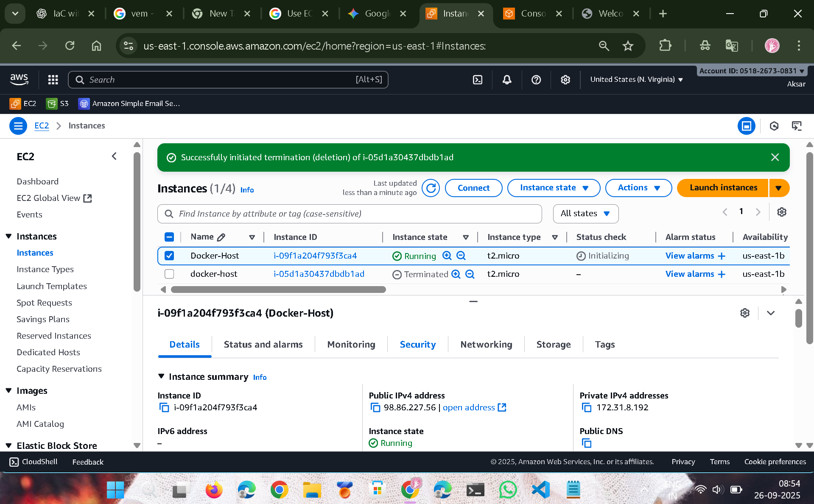
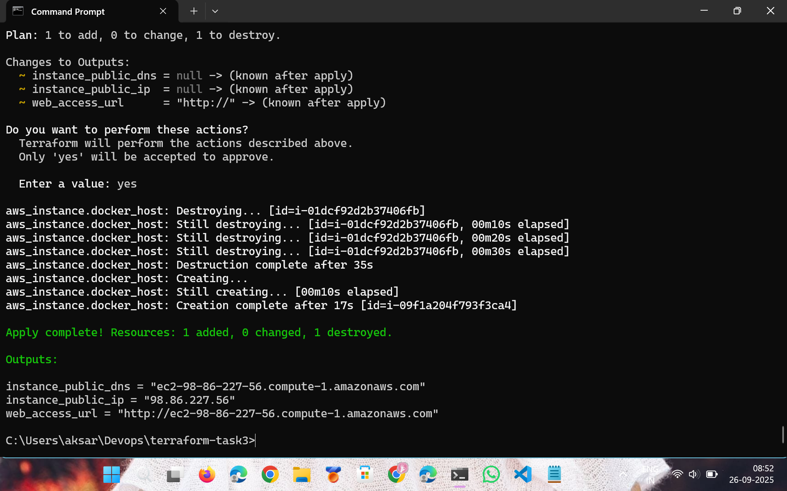
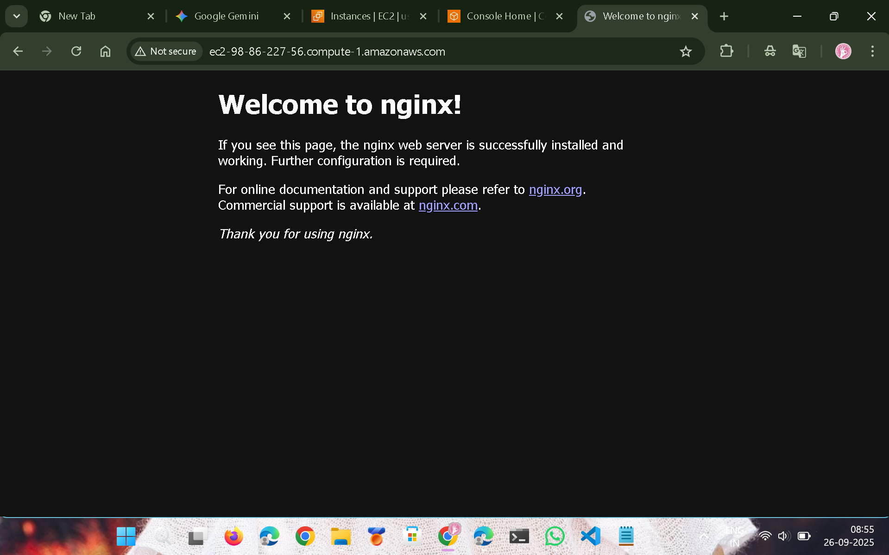

# Terraform Docker EC2 setup

## 📜 What We Did
This setup provides an automated and error-free Terraform setup to deploy an AWS EC2 instance.  
The core of this project is the **`user_data`** script, a bash script that runs at instance launch.  
It silently installs Docker and then executes a `docker run` command to start a specified container (e.g., **Nginx**).

I also performed several key fixes when i got errors to ensure the setup works reliably:

- **VPC and Subnet Configuration**:  
  Resolved a `MissingInput` error by explicitly providing the `subnet_id` in the `aws_instance` resource block.  
  This ensures the EC2 instance is launched in a valid location within your VPC.

- **Public IP Assignment**:  
  Fixed the issue of blank outputs by adding `associate_public_ip_address = true` to the `aws_instance` resource.  
  This ensures the instance gets a public IP, making it accessible from the internet.

- **Code Cleanup**:  
  Cleaned up a syntax error in the `main.tf` file where extra characters caused a parsing error.


---

## ⚙️ How to Deploy

Follow these steps to deploy the infrastructure.  
You must have **Terraform** and **AWS CLI** installed and configured.

### ✅ Prerequisites
- Terraform installed on your machine  
- AWS CLI configured with the necessary credentials  
- An existing AWS EC2 key pair (e.g., `devops`) and a VPC with subnets  

---

### 🛠 Commands

Downloads the necessary AWS provider plugins.
```bash
terraform init
```
Validate the Configuration.
```bash
terraform validate
```
Plan the Deployment
```bash
terraform plan
```
Apply the Configuration.
```bash
terraform apply --auto-approve
```

View Outputs
```bash
terraform output
```


Destroy the Infrastructure.
```bash
terraform destroy --auto-approve
```
<<<<<<< HEAD
## output


=======
>>>>>>> 12d494fe55e075ea433cbdf02797151e9bbbf837
